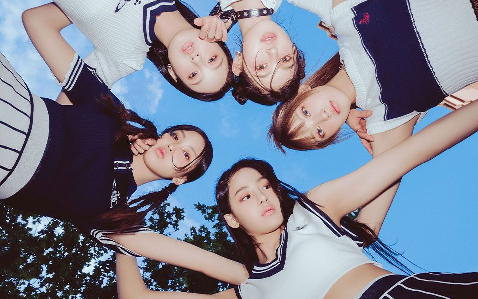

# RepetitiveInk

RepetitiveInk is a MATLAB project focused on image manipulation, particularly watermarking techniques. It employs sequential injection and repetition methods to embed watermarks into images, enhancing their security and authenticity.

## Assumption

- Input Image (Appendix - Input Image)
  - TIFF format / 960x600 / Works on RGB and grayscale.
- Input Text (Watermark)
  - String (~50 characters). Can work on longer ones
  - Longer the watermark, bigger the chance of it getting lost during cropping
- Output Image
  - TIFF format / Various size / Depends on the Input Image

## Approach

- Sequential Injection / Repetition on the whole image
  - LSB manipulation (Appendix - Output Image #1)
  - MSB manipulation (Appendix - Output Image #2)

1. Adding Marker to Watermark

- A marker is added to the watermark before embedding it into the image.
- It serves as a delimiter to identify the start of the watermark during extraction

2. Iterating Through Pixels:

- Iterate through all pixels in the image.
- Extract potential watermarks located after the marker.

3. Handling Marker in the Middle:

- If the marker is found in the middle of extracting a potential watermark:
  1. Dispose of the current potential watermark.
  2. Start the extraction process again to find the next potential watermark.

4. Selecting Final Watermark:

- After going through the whole image, analyze potential watermarks.
- Choose the watermark with the maximum length

## Result

- Injected watermark `Watermark and Copyright by Euisuh John Jeong`
  - Time taken to inject - 10 seconds
- Original Image ([Appendix - Output Image #3](#output-image-3))
  - Image is cropped by 50% of its original height and width.
  - No problem retrieving the watermark.
  - Time taken to extract - 0.04 seconds
- Cropping 50% (Appendix - Output Image #3)
  - Image is cropped by 50% of its original height and width.
  - No problem retrieving the watermark.
  - Even if the watermark is partially cropped, the algorithm starts to find the next marker and successfully retrieves the remaining watermark.
  - Time taken to extract - 0.02 seconds
- Cropping 25% (Appendix - Output Image #5)
  - Image is cropped by 25% of its original height and width.
  - No problem retrieving the watermark.
  - Time taken to extract - 0.02 seconds
- Cropping 10% (Appendix - Output Image #4)
  - Image is cropped by 10% of its original height and width.
  - Error occurred when retrieving the watermark `Watermark and Cop Euisuh John Jeong`
    - Retrieves 15-20 characters from both front and back of the watermark
  - Time taken to extract - 0.4 seconds
- Cropping 5% (Appendix - Output Image #6)
  - Image is cropped by 5% of its original height and width.
  - Error occurred when retrieving the watermark `Watermarohn Jeong`
    - Retrieves 7-10 characters from both front and back of the watermark
  - Time taken to extract - 0.1 seconds

## Appendix

### Input Image

TIFF format / 960x600 / RGB

### Output Image 1

TIFF format / 960x600 / RGB / Sequential injection / Repetition / LSB manipulation

### Output Image 2

TIFF format / 960x600 / RGB / Sequential injection / Repetition / MSB manipulation

### Output Image 3

TIFF format / 480x300 / RGB / Sequential injection / Repetition / MSB manipulation / Image cropped to preserve the central 50% of both width and height, maintaining the middle portion intact

### Output Image 4

TIFF format / 96x30 / RGB / Sequential injection / Repetition / MSB manipulation / Image cropped to preserve the central 10% of both width and height, maintaining the middle portion intact

### Output Image 5

TIFF format / 240x150 / RGB / Sequential injection / Repetition / MSB manipulation / Image cropped to preserve the central 25% of both width and height, maintaining the middle portion intact

### Output Image 6

TIFF format / 48x30 / RGB / Sequential injection / Repetition / MSB manipulation / Image cropped to preserve the central 5% of both width and height, maintaining the middle portion intact
